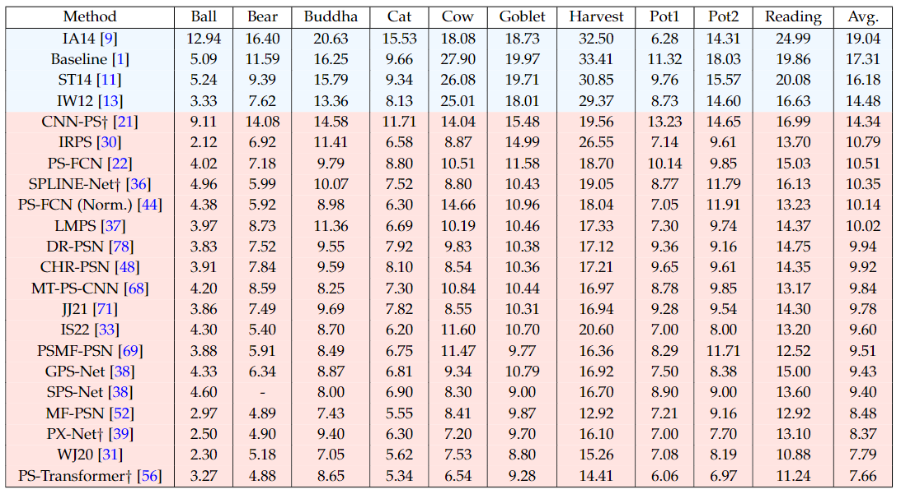
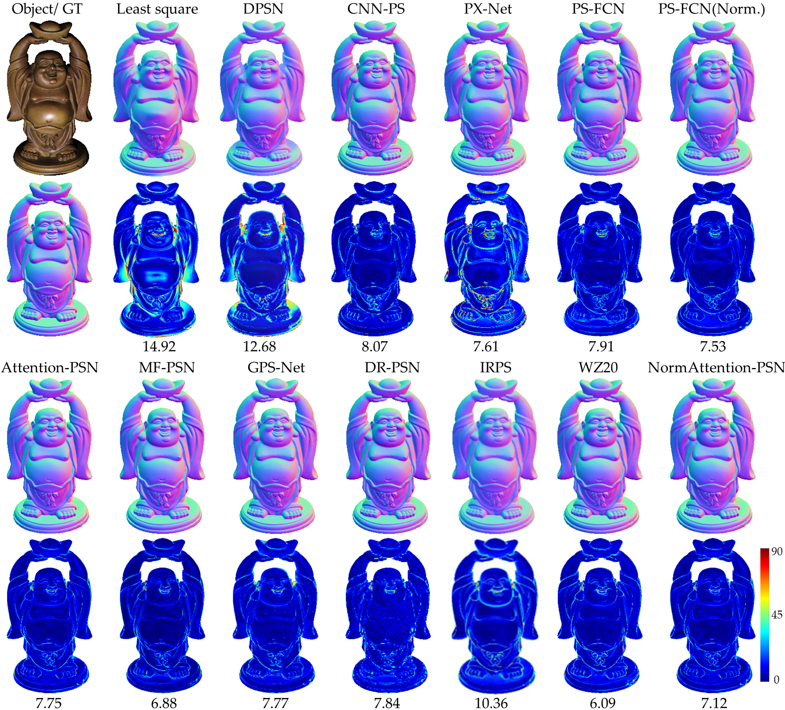
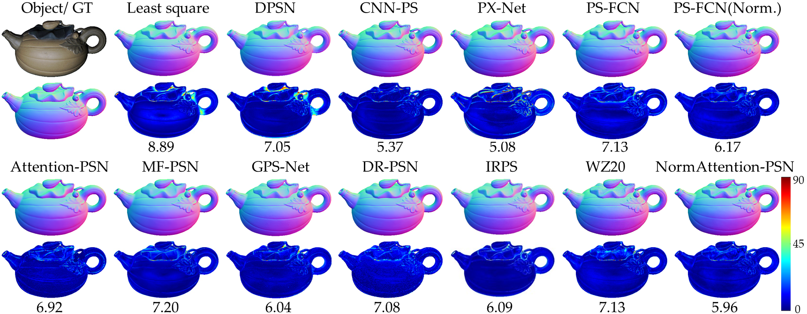

# Survey-DLCPS

## Deep Learning Methods for Calibrated Photometric Stereo and Beyond
Accepted By IEEE Transactions on Pattern Analysis and Machine Intelligence
https://arxiv.org/pdf/2212.08414.pdf
## Introduction

    

Photometric stereo methods obtain detailed shape reconstructions from multiple images under different illuminations. The orange box shows the general non-Lambertian surface reflectance. To solve the non-Lambertian surface, many methods have addressed non-Lambertian photometric stereo. This paper focuses on deep learning-based calibrated photometric stereo methods and provides a comprehensive review. 

**The purpose of this project is to collect and update deep learning-based calibrated photometric stereo methods continuously.**
 

## Categorization Based on Input Processing
The first deep learning method, DPSN [[paper](https://openaccess.thecvf.com/content_ICCV_2017_workshops/w9/html/Santo_Deep_Photometric_Stereo_ICCV_2017_paper.html), [Code](https://github.com/hiroaki-santo/deep-photometric-stereo-network)] makes the order of illuminations and the number of input images unchanged, by a seven-layer fully-connected network. To handle a varying number of inputs during training and testing, many methods were then proposed. In this section, we classify these methods based on how they process the inputs.
 

## Per-pixel methods
The per-pixel strategy is first implemented using the observation map in CNN-PS [[paper](https://openaccess.thecvf.com/content_ECCV_2018/html/Ikehata_CNN-PS_CNN-based_Photometric_ECCV_2018_paper.html), [code](https://github.com/satoshi-ikehata/CNN-PS-ECCV2018)].
 

    

The observation map aggregates the corresponding pixels from each input image into a fixed-size observation map using the 2D coordinates of the projected normalized lighting directions (along the axis-z direction). Here, a, b, and c stand for the number of input images (lights), while 1, 2, and 3 stand for the index of pixel position. 
 

### Problem of sparse input
Some works were proposed to solve the sparse input images problem, such as SPLINE-Net [[paper](https://openaccess.thecvf.com/content_ICCV_2019/html/Zheng_SPLINE-Net_Sparse_Photometric_Stereo_Through_Lighting_Interpolation_and_Normal_Estimation_ICCV_2019_paper.html), [code](https://github.com/yiming-j/SPLINE-Net)] and LMPS [[paper](https://openaccess.thecvf.com/content_CVPR_2019/html/Li_Learning_to_Minify_Photometric_Stereo_CVPR_2019_paper.html), [code](https://github.com/junxuan-li/Learning-to-Minify-Photometric-Stereo)]. These two methods adopt opposite strategies to solve the sparse inputs. SPLINE-Net proposes a lighting interpolation network to generate dense lighting observation maps when the input is sparse. LMPS reduces the demands on the number of images by only learning the critical illumination conditions via a connection table.
 
### Problem of global information

Original per-pixel methods designed to represent a single pixel, don't explicitly incorporate information from the surrounding pixel neighborhood. PX-Net [[paper](https://openaccess.thecvf.com/content/ICCV2021/html/Logothetis_PX-NET_Simple_and_Efficient_Pixel-Wise_Training_of_Photometric_Stereo_Networks_ICCV_2021_paper.html), [code]()] proposed an observation map-based method that considers global illumination effects, such as self-reflections, surface discontinuity, and ambient light, which enables global information to be embedded in the per-pixel generation process.
 

## All-pixel methods
All-pixel methods keep all the pixels together, having the advantage of exploring intra-image intensity variations across an entire input image. The original all-pixel method was introduced in PS-FCN [[paper](https://openaccess.thecvf.com/content_ECCV_2018/html/Guanying_Chen_PS-FCN_A_Flexible_ECCV_2018_paper.html), [code](https://github.com/guanyingc/PS-FCN)] through the use of a max-pooling layer, which operates in the channel dimension and fuses features from an arbitrary number of inputs.

### Problem of spatially varying BRDF 
Since all-pixel methods leverage convolutional networks to process input in a patch-based manner, they may have difficulties in dealing with steep color changes caused by surfaces with spatially varying materials. PS-FCN (Norm.)  [[paper](https://ieeexplore.ieee.org/abstract/document/9127824/), [code](https://github.com/guanyingc/PS-FCN)] proposed an observation normalization method to eliminate the impact of changing albedo. NormAttention-PSN [[paper](https://link.springer.com/article/10.1007/s11263-022-01684-8), [code](https://github.com/Kelvin-Ju/NormAttention-PSN)] further solved the normalization problem under strong non-Lambertian surfaces.

### Problem of blurry details
All-pixel methods may cause blurred reconstructions in complex-structured regions mainly because the widely used Euclidean-based loss functions can hardly constrain the high-frequency (i.e., complex-structured) representations, because of the “regression-to-the-mean” problem. Attention-PSN [[paper](https://www.ijcai.org/proceedings/2020/0097), [code](https://github.com/Kelvin-Ju/NormAttention-PSN)] and NormAttention-PSN [[paper](https://link.springer.com/article/10.1007/s11263-022-01684-8), [code](https://github.com/Kelvin-Ju/NormAttention-PSN)] proposed an attention-weighted loss to produce detailed reconstructions, which learn an adaptive weight of detail-preserving gradient loss for high-frequency regions.

### Problem of fusion efficiency
The fusion mechanism of all-pixel methods,i.e., max-pooling, discard a large number of features from the input, reducing the utilization of information and affecting the estimation accuracy. MF-PSN [[paper](https://www.sciencedirect.com/science/article/abs/pii/S0262885621002730), [code](https://github.com/Kelvin-Ju/MF-PSN)] introduces a multi-feature fusion network, utilizing max-pooling operations at different feature levels in both shallow and deep layers to capture richer information. CHR-PSN [[paper](https://link.springer.com/article/10.1007/s41095-021-0223-y), [code]()] extend max-pooling at various scales with different receptive fields, rather than the depth. HPS-Net [[paper](https://ieeexplore.ieee.org/abstract/document/10095806), [code]()] introduces a bilateral extraction module that outputs positive and negative information before aggregation to better preserve useful data.

## Hybrid methods
Hybrid approaches that combine these strategies may have the benefits of both per-pixel and all-pixel techniques. MT-PS-CNN [[paper](https://www.sciencedirect.com/science/article/pii/S0143816621003080?casa_token=UKkfqakA8DwAAAAA:ifZPYxiGdsowHGRYO8-DuV5mXq7_2xzdLaQ2CoSHaq4OHxIa15SSfpDonuZCzUzGe9G9ZHee5G8), [code]()] proposes a two-stage photometric stereo model to construct inter-frame (per-pixel) and intra-frame (all-pixel) representations. 
HT21 [[paper](https://ieeexplore.ieee.org/abstract/document/9665914?casa_token=67ZyDkNQYJ8AAAAA:YUtQzbNdkUVeBwaMCR2R_zZIXhGJV80rsK3wfUj_UxNAGCvNSOSZ_0DQ_cq5crd2N4TKZnOW9io), [code]()] built upon the observation maps but incorporated spatial information using 2D and 4D separable convolutions to better capture global effects. Similarly, PSMF-PSN [[paper](https://ieeexplore.ieee.org/abstract/document/10301617?casa_token=uRVoAXmSjnEAAAAA:4KtyctkCPrLJi0Kr9oQTNPS3k3-XwaKWZ0sSpYoC4I_U0Q8D6uuZYLCAVbwfgGElWlvp07EmS1E), [code]()] introduced a tandem manner for per-pixel and all-pixel feature extraction. GPS-Net [[paper](https://proceedings.neurips.cc/paper/2020/hash/7503cfacd12053d309b6bed5c89de212-Abstract.html), [code](https://github.com/ZhuokunYao/GPS_NET)] introduced a structure-aware graph convolutional network \cite{chang2018structure} to establish connections between an arbitrary number of observations per pixel.

## Categorization Based on Network Architectures

Most of the deep learning-based calibrated photometric stereo networks are based on convolutional networks, some advanced architectures are widely used, such as ResNet, DenseNet, and HR-Net. In recent years, Transformer with a self-attention module was also employed in the context of photometric stereo. SPS-Net [[paper](https://ieeexplore.ieee.org/abstract/document/9310261?casa_token=4HSHz4ve0V8AAAAA:1y56NDUqc23qLi1ql-izOTesbntsgmdkf13RB50TS659iP2nGmpmk0hzxMWH0QoUsv9fa1XzeKQ), [code]()] is the first to propose a self-attention photometric stereo network, which aggregates photometric information through a self-attention mechanism.  PS-Transformer  [[paper](https://www.bmvc2021-virtualconference.com/assets/papers/0319.pdf), [code](https://github.com/satoshi-ikehata/PS-Transformer-BMVC2021)]  then designed a dual branch to explore pixel and image-wise feature for sparse photometric stereo images.

The photometric stereo task can leverage the self-attention module effectively. Theoretically, the surface normal of a point only depends on itself, rather than its relationship with distant points. However, due to the presence of shadows and inter-reflections, capturing long-range context becomes essential for accurate feature extraction. Therefore, Transformer-based photometric stereo models can benefit from both the non-local information acquired through the self-attention module and the embedded local context information obtained through traditional convolutional layers. 

##  Categorization Based on Supervision

    

we summarize the differences among supervised, self-supervised, and multi-supervised photometric stereo networks.

### Supervised photometric stereo methods

Plenty of deep photometric stereo networks have been proposed with the supervised framework. A few methods (DPSN [[paper](https://openaccess.thecvf.com/content_ICCV_2017_workshops/w9/html/Santo_Deep_Photometric_Stereo_ICCV_2017_paper.html), [Code](https://github.com/hiroaki-santo/deep-photometric-stereo-network)], CNN-PS [[paper](https://openaccess.thecvf.com/content_ECCV_2018/html/Ikehata_CNN-PS_CNN-based_Photometric_ECCV_2018_paper.html), [code](https://github.com/satoshi-ikehata/CNN-PS-ECCV2018)], LMPS [[paper](https://openaccess.thecvf.com/content_CVPR_2019/html/Li_Learning_to_Minify_Photometric_Stereo_CVPR_2019_paper.html), [code](https://github.com/junxuan-li/Learning-to-Minify-Photometric-Stereo)]) utilized the L2 loss (mean squared error loss) to optimize the training, while the others applied the cosine loss.

## Self-supervised photometric stereo methods

Measuring the surface normals of real objects is very difficult and expensive, because it needs high-precision 3D scanners to reconstruct the ground-truth shape, and requires much manpower to align the viewpoints between surface normal maps and multiple images (pixel alignment). Synthetic training data is a possible way, but still requires efforts to generate photo-realistic synthetic images. Self-supervised learning strategy can overcome the above shortcomings to some extent. IRPS [[paper](https://proceedings.mlr.press/v80/taniai18a.html), [Code](https://github.com/t-taniai/neuralps)] first proposed a self-supervised convolutional network
that took the whole set of images as input. The model directly generated surface normals by minimizing the reconstruction loss between re-rendered images obtained via the rendering equation and input images. KS21 [[paper](https://openaccess.thecvf.com/content/CVPR2021/papers/Kaya_Uncalibrated_Neural_Inverse_Rendering_for_Photometric_Stereo_of_General_Surfaces_CVPR_2021_paper.pdf), [Code](https://github.com/suryanshkumar/Uncalibrated_PS_CVPR21)] further extended to deal with inter-reflection by explicitly modeling the concave and convex parts of a complex surface.  Recently, LL22a [[paper](https://openaccess.thecvf.com/content/CVPR2022/papers/Li_Neural_Reflectance_for_Shape_Recovery_With_Shadow_Handling_CVPR_2022_paper.pdf), [Code](https://github.com/junxuan-li/Neural-Reflectance-PS)] proposed a coordinate-based deep network to parameterize the unknown surface normal and the unknown reflectance at every surface point. The method learned a series of neural specular basis functions to fit the observed specularities and explicitly parameterized shadowed regions by tracing the estimated depth map.
 
## Multi-supervised photometric stereo methods

IS22 [[paper](https://ieeexplore.ieee.org/document/9898033), [Code]()]  proposed a network to deconstruct the observation map into physical interpretable components such as surface normal, surface roughness, and surface base color. These components were then integrated via the physical formation model. Consequently, the training loss for optimization consisted of the normal reconstruction loss and the inverse rendering loss. DR-PSN [[paper](https://ieeexplore.ieee.org/abstract/document/9376632), [Code]()]  introduced a dual regression network for calibrated photometric stereo. This network combined the surface-normal constraint with the constraint of the reconstructed re-lit image. Additionally, GR-PSN [[paper](https://ieeexplore.ieee.org/abstract/document/10306333), [Code](https://github.com/Kelvin-Ju/GR-PSN)]  utilized a parallel framework to simultaneously learn two arbitrary materials for an object and included an additional material transform loss. These methods employed an inverse subnetwork to re-render reconstructed images based on predicted surface normals. They used CNNs to render reconstructed images rather than following the rendering equation.

## Data sets for photometric stereo

### Training data sets

Blobby and Sculpture data set, rendered by MERL BRDFs.  [Download Web](http://www.visionlab.cs.hku.hk/data/PS-FCN/datasets/)

    

CyclesPS data set,  rendered by Disney’s principled BSDFs.  [Download Web](https://github.com/satoshi-ikehata/CNN-PS-ECCV2018)

    

### Testing data sets
Gourd&Apple data set [[paper](https://ieeexplore.ieee.org/document/4587656), [DownloadWeb](http://vision.ucsd.edu/~nalldrin/research/)] 

    

Light Stage Data Gallery [[paper](https://ieeexplore.ieee.org/document/1541276), [DownloadWeb](https://vgl.ict.usc.edu/Data/LightStage/)] 

    

DiLiGenT data set [[paper](https://ieeexplore.ieee.org/document/8281537), [DownloadWeb](https://sites.google.com/site/photometricstereodata/single)] 

    

DiLiGenT-10^2 data set [[paper](https://openaccess.thecvf.com/content/CVPR2022/papers/Ren_DiLiGenT102_A_Photometric_Stereo_Benchmark_Dataset_With_Controlled_Shape_and_CVPR_2022_paper.pdf), [DownloadWeb](https://photometricstereo.github.io/diligent102.html)] 

    

DiLiGenT-Pi data set [[paper](https://openaccess.thecvf.com/content/ICCV2023/papers/Wang_DiLiGenT-Pi_Photometric_Stereo_for_Planar_Surfaces_with_Rich_Details_-_ICCV_2023_paper.pdf), [DownloadWeb](https://photometricstereo.github.io/diligentpi.html)] 

    

## Benchmark Evaluation 

    

Performance on the DiLiGenT benchmark with 96 images, measured in terms of MAE in degrees. The compared methods are ranked by the average MAE of ten objects. 

    

Performance on the DiLiGenT benchmark with 10 images, measured in terms of MAE in degrees. The compared methods are ranked by the average MAE of ten objects. 

### Comparisons Visualization  

    

Quantitative results for object BALL, tested with 96 input images, in terms of MAE in degrees.

    

Quantitative results for object BEAR, tested with 96 input images, in terms of MAE in degrees.

    

Quantitative results for object BUDDHA, tested with 96 input images, in terms of MAE in degrees.

    

Quantitative results for object CAT, tested with 96 input images, in terms of MAE in degrees.

    

Quantitative results for object COW, tested with 96 input images, in terms of MAE in degrees.

    

Quantitative results for object GOBLET, tested with 96 input images, in terms of MAE in degrees.

    

Quantitative results for object HARVEST, tested with 96 input images, in terms of MAE in degrees.

    

Quantitative results for object POT1, tested with 96 input images, in terms of MAE in degrees.

    

Quantitative results for object POT2, tested with 96 input images, in terms of MAE in degrees.

    

Quantitative results for object READING, tested with 96 input images, in terms of MAE in degrees.
